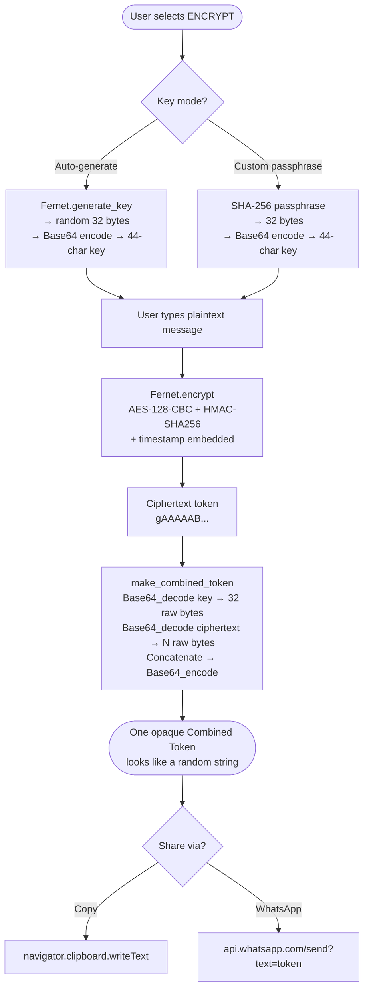

# 🔐 Message Encrypt / Decrypt


Secure messaging app that encrypts and decrypts messages using **Fernet symmetric encryption** (AES-128-CBC + HMAC-SHA256). Features a **combined token** that merges the key and ciphertext into one opaque string, a **passphrase mode** requiring zero key exchange, and a hard-coded **5-minute message expiry**.

---

## 🔄 How It Works



---

## 🚀 Quick Start

```bash
git clone <repo-url>
cd message_encrypt_decrypt
python -m venv venv
source venv/bin/activate       # Windows: venv\Scripts\activate
pip install -r requirements.txt
streamlit run app.py
```

App opens at **http://localhost:8501**

---

## 📂 Project Structure

```
message_encrypt_decrypt/
├── app.py              # Main Streamlit application
├── requirements.txt    # Python dependencies
├── README.md           # This file
└── .streamlit/
    └── config.toml     # Dark theme config
```

---

## 🔧 Tech Stack

| Component | Technology |
|---|---|
| UI | Streamlit |
| Encryption | cryptography (Fernet — AES-128-CBC + HMAC-SHA256) |
| Key Derivation | hashlib SHA-256 |
| Sharing | WhatsApp URL scheme, navigator.clipboard |
| Language | Python 3.10+ |

---

## 🛡️ Key Features

| Feature | Description |
|---|---|
| **Auto key generation** | Random 256-bit Fernet key on Encrypt selection |
| **Passphrase mode** | SHA-256 derived key — no key ever transmitted |
| **Combined token** | Key + ciphertext merged into one Base64 blob — looks random |
| **5-minute expiry** | Hard-coded TTL on every message — cannot be changed |
| **Copy to clipboard** | `navigator.clipboard` — no external JS libs |
| **Share on WhatsApp** | Combined token pre-filled in WhatsApp |
| **Paste from WhatsApp** | Auto-detects combined token or labelled format, auto-decrypts |

---

## 📊 Security Design

| Decision | Rationale |
|---|---|
| Key sent separately from ciphertext | Sending both together lets any interceptor decrypt |
| Combined token merges them opaquely | Key boundary unknown without app — looks like noise |
| Passphrase mode eliminates key transit | Shared secret never leaves either device |
| 5-minute TTL | Limits the window an intercepted token is useful |
| HMAC-SHA256 | Any tampered bit causes decryption to fail |

---

## 👤 Author

**Seelaboyina Deekshith**

[](https://github.com/Deekshith06)
[](https://www.linkedin.com/in/deekshith030206)
[](mailto:seelaboyinadeekshith@gmail.com)

---

> ⭐ Star this repo if it helped you!
